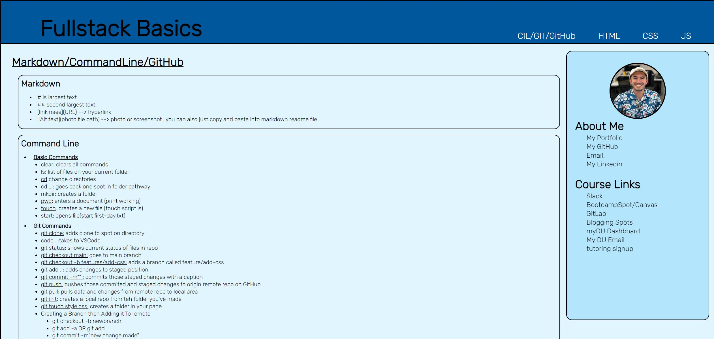
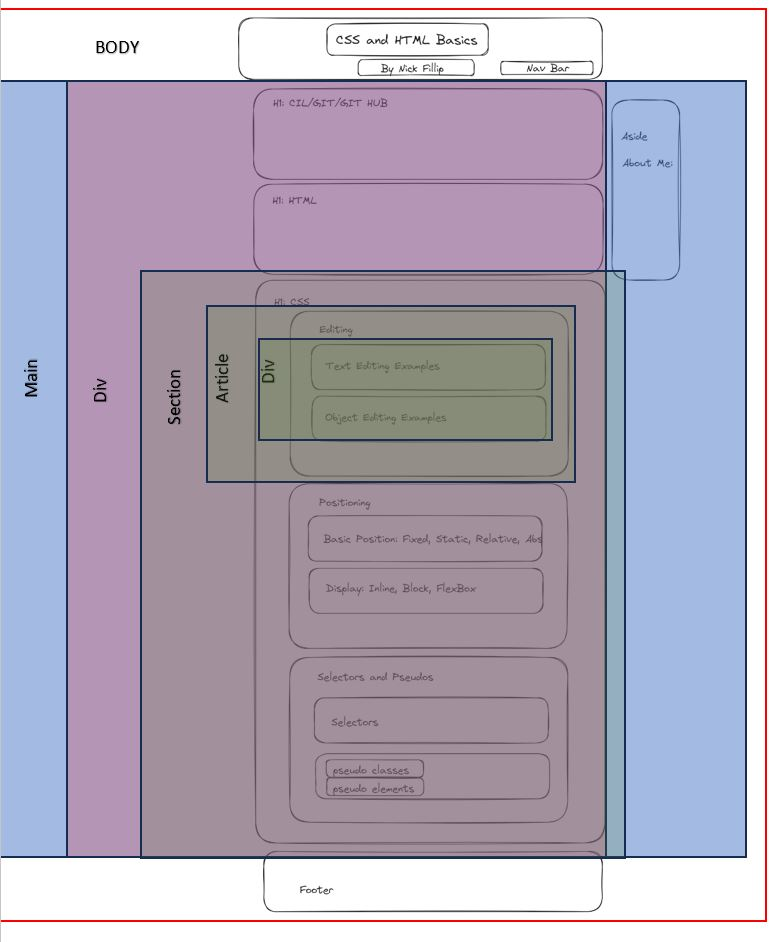

# fullstack-website-notes

## Description

A website compiling all the high-level information taken so far in the bootcamp.

## Installation

N/A

## Usage

To see how syntax is written and selectors are functioning, open the inpect console on the website to read through css and html code. I used flexbox to design the wireframe of the website, but I did change header and aside to fixed with viewport units for sizing. 

## License

MIT

## Credits

UDenver Bootcamp Course

## Website Screenshot
[Fullstack Website Notes LINK](https://nfillip.github.io/fullstack-website-notes)

